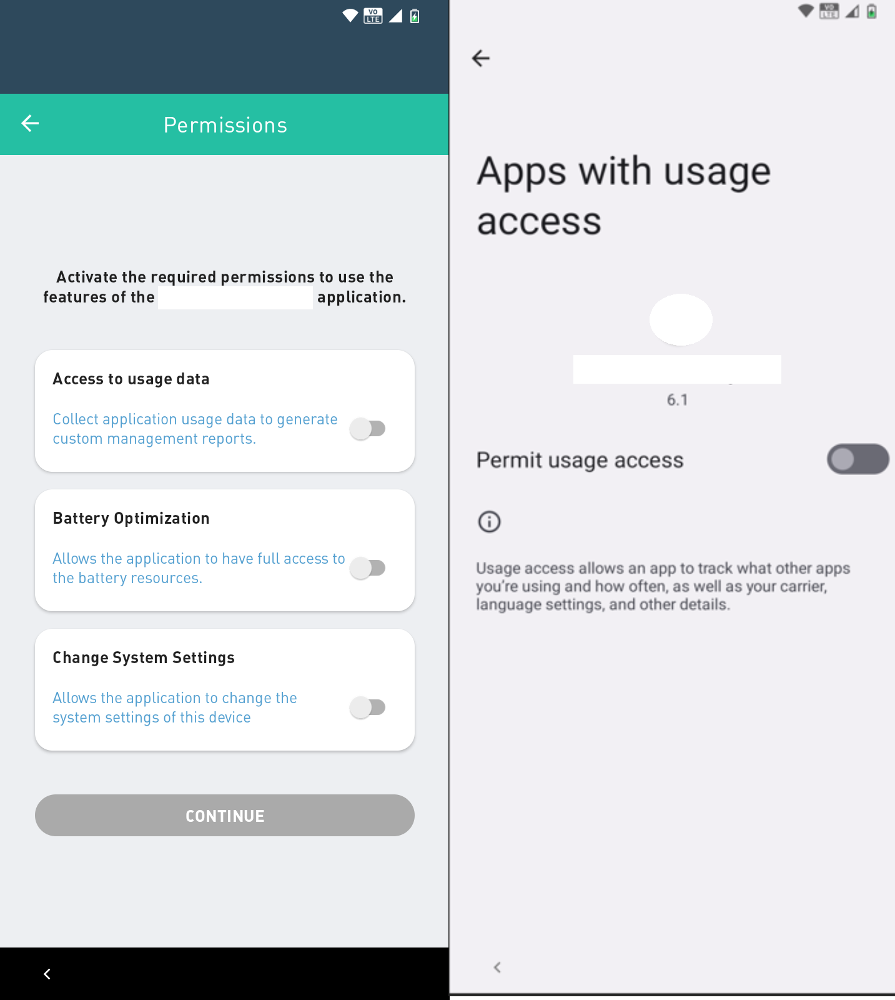
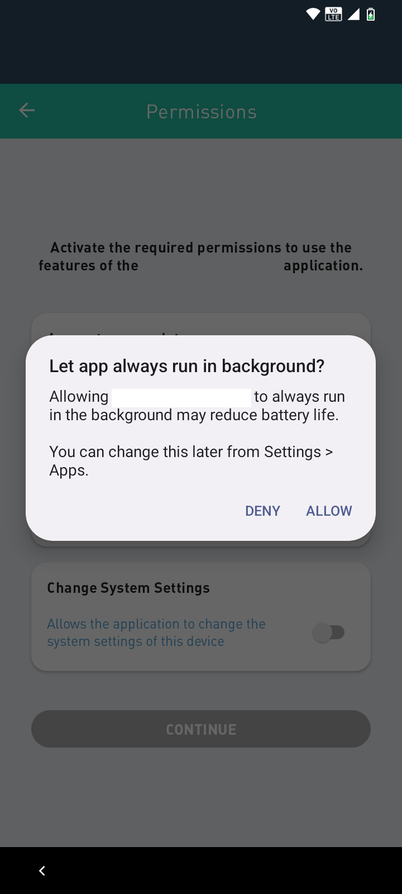
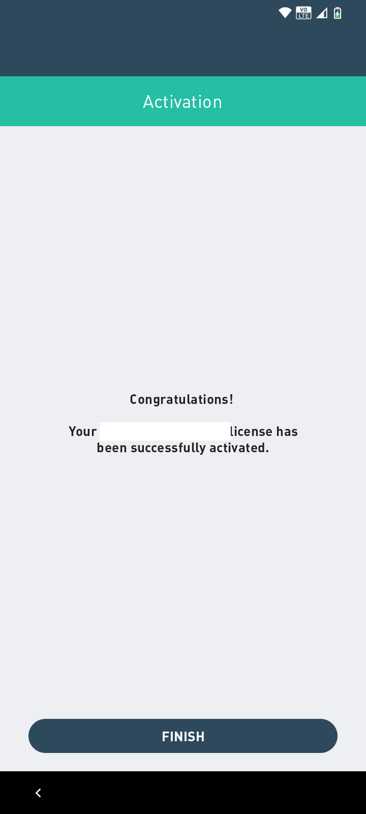

# Activation

1. To start the license activation, press the "Start" button&#x20;
2. Read and check the box for the Terms and Conditions of Use of the application and press "Accept"

<figure><figcaption></figcaption></figure>

3. After granting the permissions, enter the license number;


**IMPORTANT**

If the company registers in the form of quantity licenses, it will not be necessary to communicate a license number.


4. By activating the "Access to usage data" permission, the requested permission will be displayed

<figure><figcaption></figcaption></figure>

5. A notification will then be displayed where you must click Allow to continue with the activation. Also enable the Battery Optimization permission to enable the Continue button.

<figure><figcaption></figcaption></figure>

6. That's it! Your **Datamob Enterprise** license has been activated. Tap finish to start using the device.

<figure><figcaption></figcaption></figure>
