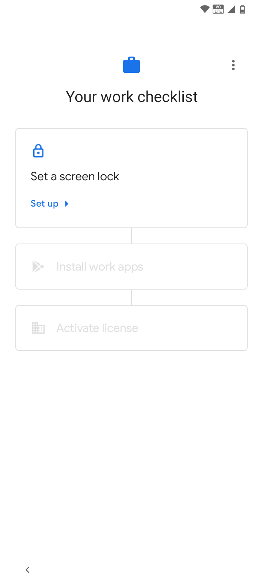

# Settings

After registering using one of the 3 options mentioned in the previous sections, the "Work Checklist" screen will be displayed. On this screen we will make the necessary settings to move forward with the **Datamob Enterprise** activation process.

1. Accept and make all the settings on the device screens until you reach the following screen

<figure><figcaption></figcaption></figure>

2. Set a screen lock for the device:

<figure><figcaption></figcaption></figure>

3. In the work checklist, the next step is to install work applications. Press "Install". The next screen will display the work applications available for installation. This depends on your company's work settings. Press the "Done" button to continue.
4. The next step on the "Work Checklist" screen is "Activate license". Start the activation process by pressing "Configure". After clicking on "Configure", the screen will appear to start the activation of **Datamob Enterprise**.

<figure><figcaption></figcaption></figure>

<figure><figcaption></figcaption></figure>
