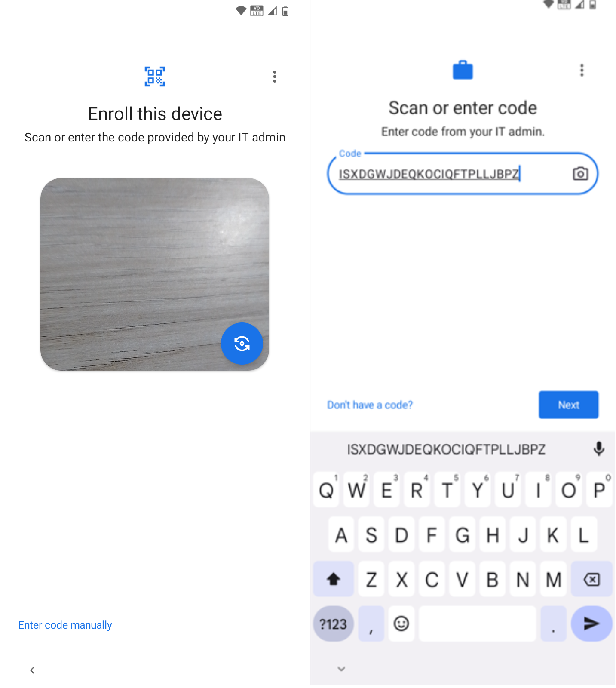

# Registration Token

To register via token, the user must have access to the token code generated by the system administrator. The token can be used if the user cannot read the QR Code.

In this case, the user must click on the highlighted option on the first screen and enter the code on the second screen:

<figure><figcaption></figcaption></figure>

After entering the Token Code, you must activate Google Settings or the Operating System until you reach the "Work Checklist" screen.
